# Pillmedic 💊

Pillmedic is a modern, feature-rich iOS medication management and health tracking application built with **SwiftUI** and **SwiftData**. It helps users effortlessly schedule medications, track daily compliance, manage family profiles, connect with healthcare providers, and review comprehensive adherence statistics.

---

## ✨ Core Features

* **Add Medicine**: Quickly input and save new medicine details.
* **Schedule Medicine**: Configure custom frequencies, durations, and meal timings (Before/After meal) after adding a medication.
* **Doctor Management**: Add, view, and communicate with specialized doctors and keep track of upcoming appointments.
* **Family Members**: Add and manage family members, allowing you to view and share essential medical information under a single account.
* **Statistics & Progress**: Display detailed weekly and monthly statistics and calendar views for medication adherence.
* **Update Profile**: Seamlessly update personal profile settings and account preferences.
* **Logout**: Securely log out from the application.

---

## 🛠️ Tech Stack & Language

* **Language**: Swift
* **User Interface**: SwiftUI
* **Persistence**: SwiftData

---

## 🏗️ Architecture & Component Overview

Managed at the entry point (`PillmedicApp.swift`), the application flow starts with the initial tutorial experience (`TutorialView`) before transitioning into the core tab layout (`MainTabView`) connecting core functional modules:

```
[TutorialView] ──► [MainTabView] ──┬──► Today (Medicine Management)
                                   ├──► Progress & Adherence Statistics
                                   ├──► Family Caregiver Profiles
                                   ├──► Doctor Directories & Appointments
                                   └──► Account Settings & Preferences
```

### Key Architectural Modules:
1. **App Entry & State Management (`PillmedicApp.swift`)**: Configures local data storage and app-wide launch sequencing.
2. **Onboarding & Tutorial (`TutorialView.swift`)**: Handles interactive page-view walkthroughs for new users.
3. **Progress & Analytics Module (`ProgressView.swift`, `MedicineCalendarView.swift`)**: Displays active prescriptions and monthly/weekly color-coded calendar streaks (`.taken`, `.missed`, `.lateTaken`).
4. **Authentication & Profile (`AccountView.swift`, `LoginView.swift`)**: Secures access with validation workflows and centralizes user metrics.
5. **Caregiver & Practice (`FamilyMembersView.swift`, `DoctorListView.swift`)**: Unifies multi-profile family tracking and physician management.

---

## 📱 Screenshots & UI Overview

### Tutorial
| Tutorial Screen 1 | Tutorial Screen 2 |
| :---: | :---: |
| 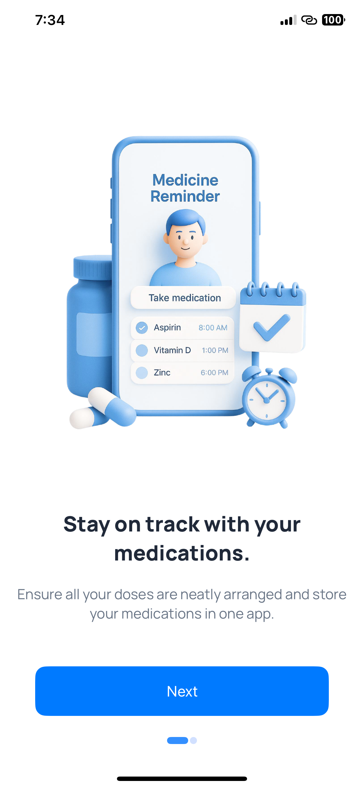 | 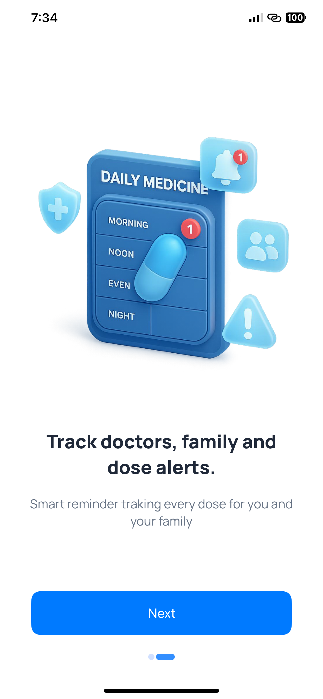 |

### Medicine
| Medicine Dashboard | Add Medicine |
| :---: | :---: |
| 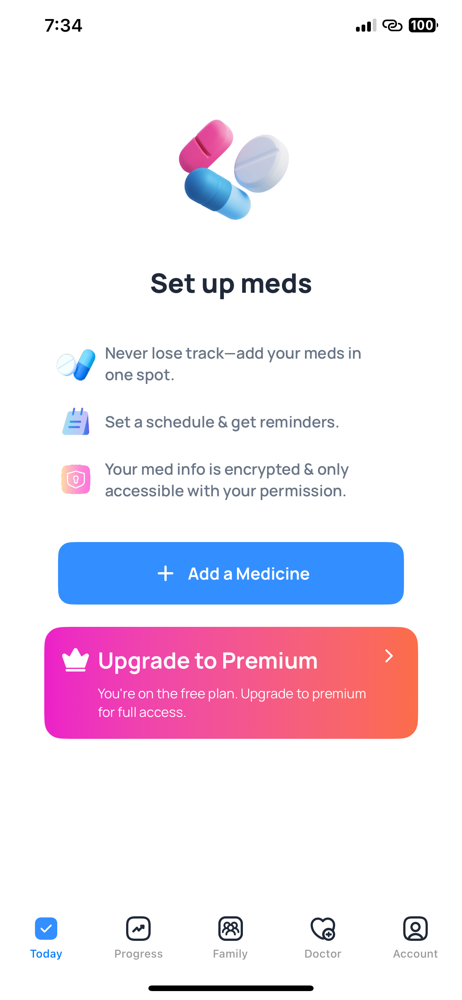 | 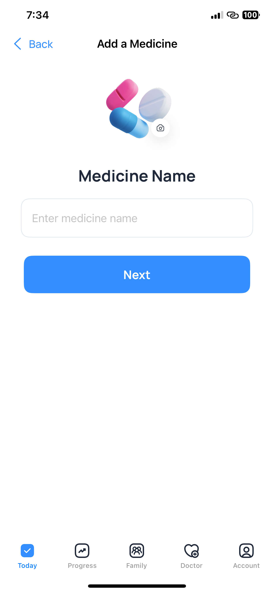 |

| Schedule Medicine | Medicine Details |
| :---: | :---: |
| 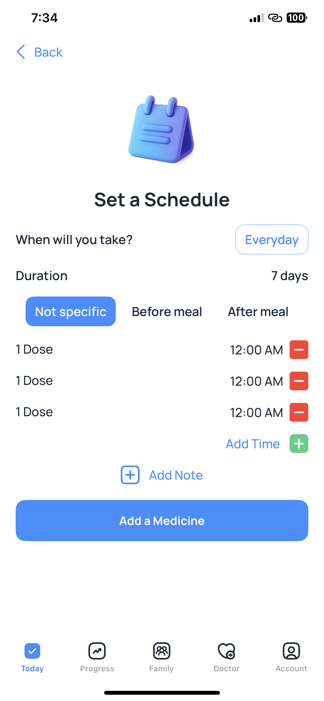 | 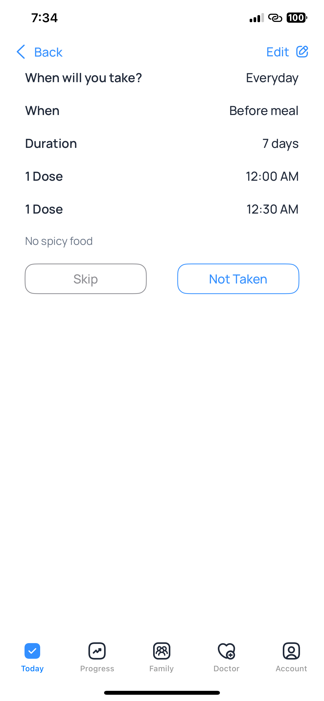 |

| All Medicines | Statistics |
| :---: | :---: |
| 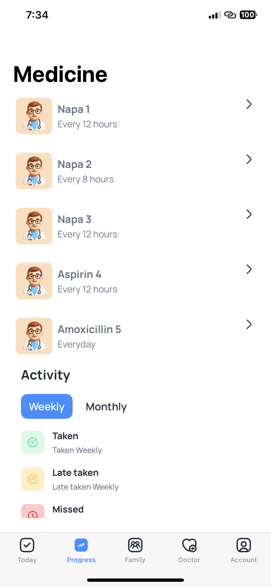 | 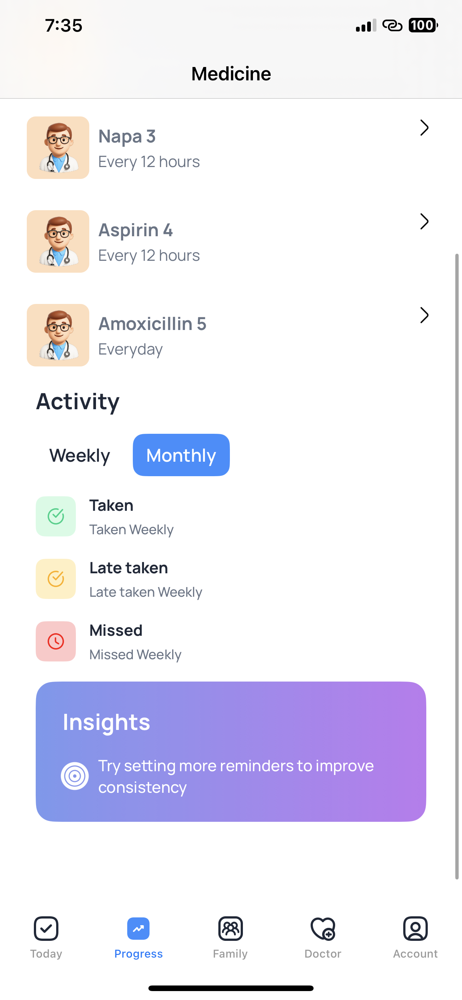 |

### Family
| Family Members | Add Family |
| :---: | :---: |
| 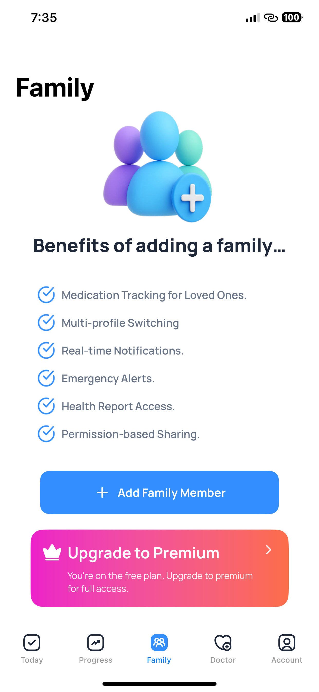 | 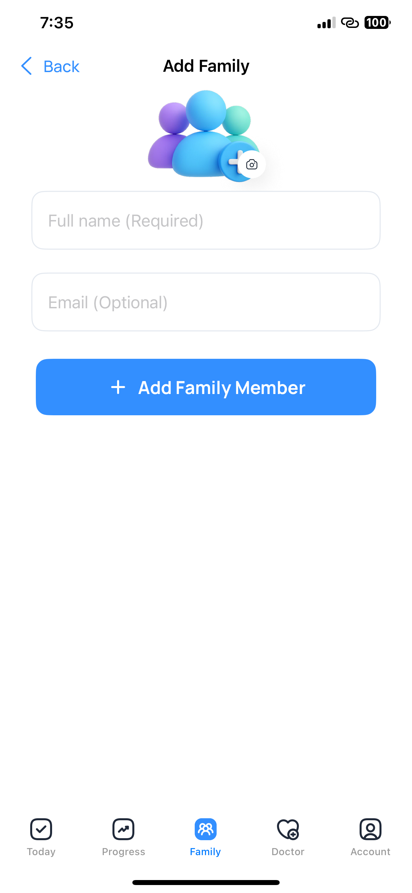 |

### Doctor
| Doctor Directory | Add Doctor |
| :---: | :---: |
| 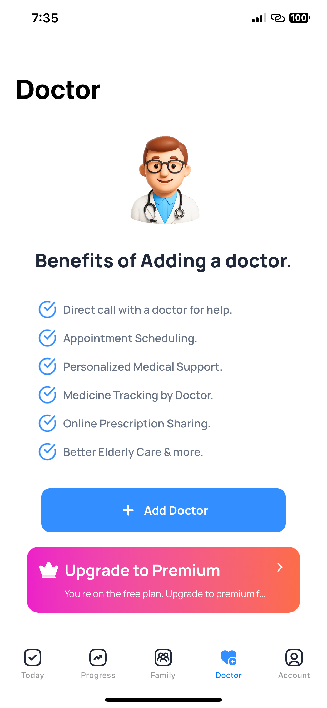 | 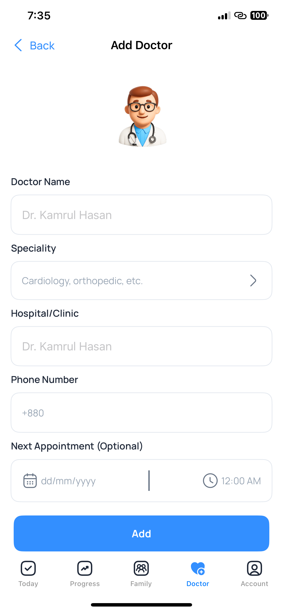 |

### Profile
| Profile Settings | Profile Details |
| :---: | :---: |
| 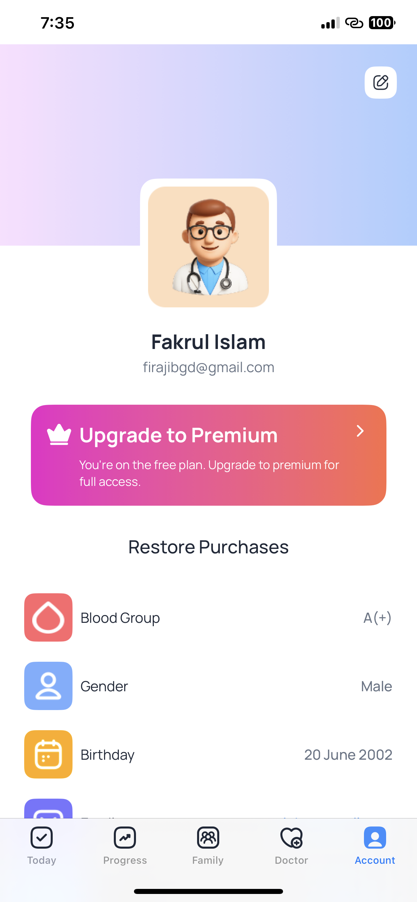 | 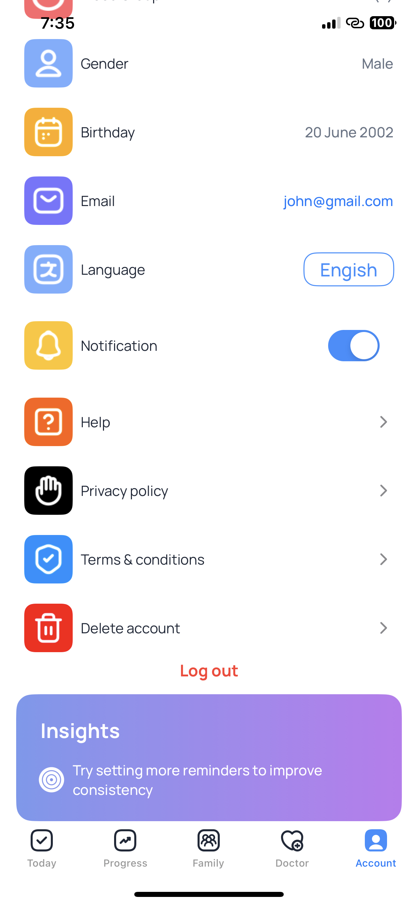 |

---

## 🚀 Getting Started

1. **Prerequisites**: Ensure you have **Xcode 15+** and **iOS 17+** configured.
2. **Clone the Repository**:
   ```bash
   git clone https://github.com/dulal0026/Pillmedic.git
   ```
3. **Open Project**: Open `Pillmedic.xcodeproj` in Xcode.
4. **Run**: Select your target simulator and press `Cmd + R` to build and run the app.
